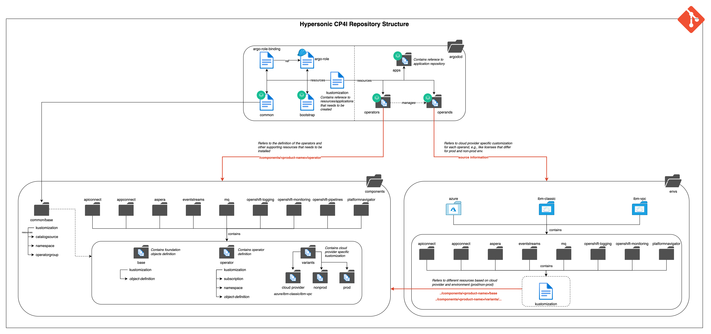

## Introduction

This repo can be used to install IBM Cloud Pak 4 Integration capabilities and sample applications. CP4I documentation: https://www.ibm.com/docs/en/cloud-paks/cp-integration

## Repository Structure



## Instructions

You should have an existing OpenShift cluster available. 

Make sure that the default storage class is block storage, verify that you have a storage class with the "default" annotation: ```storageclass.kubernetes.io/is-default-class: 'true'```

### Fork this repo and adapt it for your environment

First, fork this repo. Now update the following files that refer to your repo url:

- [kustomization.yaml](./argocd/kustomization.yaml)
- [bootstrap.yaml](./argocd/bootstrap.yaml)

Now chose which operators, operands and type of environment:

- [all-operators](argocd/operators/all-operators.yaml) By default, CP4I operators are installed into the 'cp4i' namespace. If you want to change this, you can update the setting per operator. 
- [all-operands.yaml](argocd/operands/all-operands.yaml) Here, select which capabilities you want to install. Also update with your environment, using ODF storage (odf), IBM Classic infrastructure (ibm-classic), IBM VPC infrastructure (ibm-vpc), Azure (azure or azure-nfs) and AWS (aws) are valid values

### Install the OpenShift GitOps operator

From OperatorHub, find the OpenShift GitOps operator and install it with the recommended defaults. For details, see https://docs.openshift.com/gitops/1.12/installing_gitops/installing-openshift-gitops.html

### (Optional) Add a webhook to the OpenShift GitOps server

Add a webhook to https://your-gitops-server.com/api/webhook for the push event. For details, see https://argo-cd.readthedocs.io/en/stable/operator-manual/webhook/

### Add the bootstrap ArgoCD application to install operators

Apply the [bootstrap.yaml](./argocd/bootstrap.yaml) file to your OpenShift cluster, via the CLI or UI. The bootstrap ArgoCD application will find the [kustomization.yaml](./argocd/kustomization.yaml) file which points to the [common.yaml](./argocd/common.yaml) application and an ArgoCD ApplicationSet [all-operators.yaml](./argocd/operators/all-operators.yaml)

The "common" application creates a namespace (cp4i by default) and a catalogsource for the IBM operators.

The all-operators.yaml ApplicationSet generates ArgoCD applications for your selected operators based on a simple naming convention, pointing into the components subdirectory where Subscriptions for each operator can be found.

After applying the bootstrap file, the operators will be installed. By default, these are installed in the cp4i namespace. You can check the status in the OpenShift Console under Operators / Installed Operators.

### Add the IBM entitlement key to access the container registry

Create an image pull secret in the 'cp4i' namespace with the name ibm-entitlement-key, address cp.icr.io, username cp and your entitlement key as password.

### Install operands / capabilities

Now, uncomment the line referring to 'operands/all-operands.yaml' in [kustomization.yaml](./argocd/kustomization.yaml)

The [all-operands.yaml](argocd/operands/all-operands.yaml) ApplicationSet generates ArgoCD applications for your selected capabilities. If you didn't change anything, only Platform Navigator is installed from the CloudPak, together with OpenShift Logging, OpenShift Monitoring and Stakater Reloader.

If you have enabled the webhook earlier, ArgoCD will refresh and trigger install of the capabilities. If you didn't, open ArgoCD and refresh the bootstrap application in the UI. This happens automatically after 3 minutes.


### Create index patterns for OpenShift Logging

Click the Logging menu item in the OpenShift Console. In the Kibana interface, create two index patterns: 'app' and 'infra' that map to '@timestamp'


### (Optional) Enable the LetsEncrypt issuer

In the file [components/platformnavigator/base/kustomization.yaml](components/platformnavigator/base/kustomization.yaml) uncomment the line referring to 'letsencrypt-clusterissuer.yaml'