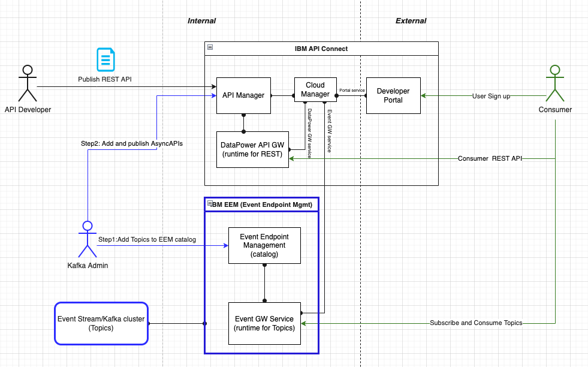

## Pre-requisite
* Prepare openshift cluster.
  
If on ROKS, follow [this instruction](https://cloud.ibm.com/docs/openshift?topic=openshift-deploy-odf-vpc&interface=ui) to enable ODF and operatorhub.

* Follow instructions to install CP4I components using [Hypersonic GitHub](https://github.com/Nordic-MVP-GitOps-Repos/hypersonic-lightweight-cp4im), add the following capabilities:
    - MQ
    - Event Endpoint Management
    - Event Streams
    - API Connect
    - Event Processing (optional)

## Steps to add ES cluster to EEM

### 1. Add Event Streams cluster to EEM and add topics

See. https://github.com/Nordic-MVP-GitOps-Repos/hypersonic-lightweight-cp4i/blob/main/components/eventendpointmgmt/eem-seed/reset-all-data.sh

### 2. Add a EEM user in Keycloak and verify with kcat
See [this guideline](https://ibm.github.io/event-automation/eem/security/user-roles/#assign-roles-keycloak) to create and assign a user as a viewer in EEM.

Create a new user in EEM and add the role `eem-viewer`. 

This user can be used to test the non-admin UI and catalog. Try consuming from the topics shared in EEM using [kcat](https://docs.confluent.io/platform/current/tools/kafkacat-usage.html) and the example snippets in the EEM UI.

## Steps to Config APIC

### 1. Configure provider organization and developer portal in APIC
In APIC Cloud Manager (login as `integration-admin`), setup a valid email server (for example using   [mailtrap](https://mailtrap.io/)) and create a provider organization with a new admin user in the API Manager user repository. 

### 2. Add declarative APIs and API Products

* Follow instructions [here](https://www.ibm.com/docs/en/cloud-paks/cp-integration/16.1.1?topic=resources-using-api-kubernetes-resource#add-the-api-resource-as-a-draft-to-an-api-manager__title__1) to setup a secret which allows the CP4I operator to connect to APIC, use the admin user credentials that you created for the APIC provider organization.

* Uncomment the line `apis-and-products.yaml` in [kustomization.yaml](../../argocd/kustomization.yaml), use ArgoCD to add declarative APIs to API manager. Make sure to update the git repo url in the apis-and-product.yaml file to point to your repository.

* Verify that the Products and APIs are deployed in APIC Sandbox catalog.

* Create a consumer account in APIC Developer Portal,  let consumer to subscribe to the REST API,  verify the API access and confirm that API responds as expected. 

## Setup EEM and APIC Integration

To integrate EEM into APIC, follow the steps below:

### 1. Configure EEM for APIC Integration  
- Configure EEM to trust API Connect. Use script: https://github.com/Nordic-MVP-GitOps-Repos/hypersonic-lightweight-cp4i/blob/main/components/eventendpointmgmt/base/configure-trust-to-apic.sh
- Register Event Manager as an Event Gateway Service. Use script: https://github.com/Nordic-MVP-GitOps-Repos/hypersonic-lightweight-cp4i/blob/main/components/apiconnect/base/setup-eem-remote-gateway.sh

➡ [IBM Documentation: Configure EEM for APIC](https://ibm.github.io/event-automation/eem/integrating-with-apic/configure-eem-for-apic/)  

### 2. Generate and Import AsyncAPI Document  
After integration, generate and import the AsyncAPI document from EEM into APIC. Either manually from the APIC UI, or by exporting from EEM Admin REST endpoint and creating API and Product CRs in Git. See: https://ibm.github.io/event-automation/apiCode/eem-api/11.4/eem-api.html#exportapicasyncapi

➡ [IBM Documentation: Generate AsyncAPI](https://ibm.github.io/event-automation/eem/integrating-with-apic/generate-asyncapi/)  
